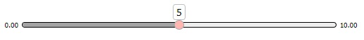
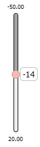
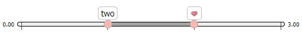
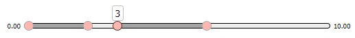

# SliderView
Проект является имплементацией слайдера по программе обучения 
[FSD](https://www.fullstack-development.com/). \
Использованы: \
[TypeScript](https://www.typescriptlang.org/), [JQuery](https://jquery.com/) \
[SCSS](https://sass-lang.com/) - препроцессор CSS, \
[Jest](https://jestjs.io/) - для тестов, \
[Webpack](https://webpack.js.org/) - для сборки. \
Страница с демонстрацией на 
[gh-pages](https://liquense.github.io/FSD-task-4/dist/index)

## Установка
```
git clone https://github.com/Liquense/FSD-task-4
npm install
```
#### Команды
Сборка: `npm run build` \
Сборка с дев-сервером: `npm run dev-server` \
Приложение покрыто тестами: `npm run test` \
Проверка линтером: `npm run eslint`

## Использование
Импортировать **JQuery** и **liquidSlider.ts**. \
Инициализировать плагин с помощью функции `.liquidSlider()` у JQuery-объекта - он будет заменён слайдером. \
Несколько примеров:

##### Вариант 1 
Стандартный слайдер \
 
```typescript
const sliderInitSelector = 'your selector'; // ваш селектор

$(sliderInitSelector).liquidSlider();
```
##### Вариант 2
Вертикальный слайдер с пользовательскими минимумом, максимумом и шагом \

```typescript 
$(sliderInitSelector).liquidSlider({
  min: -50,
  max: 20,
  step: 2,
  isVertical: true,
});
```
##### Вариант 3
Слайдер с передачей пользовательских данных, двумя стандартными ползунками,
отображаемой разметкой \

```typescript
$(sliderInitSelector).liquidSlider({
  items: [
    1,
    { toString(): string { return 'two'; } },
    "",
    'last',
  ],
  isRange: true,
  withMarkup: true,
});
```
##### Вариант 4
Слайдер с передачей собственных ползунков
(количество, положение, с кем связаны)
и отображением подсказки только на активном ползунке \

```typescript
$(sliderInitSelector).liquidSlider({
  handlers: [
    { rangePair: 'start' },
    { itemIndex: 2, rangePair: 0 },
    { itemIndex: 3, rangePair: 3 },
    { itemIndex: 6 },
  ],
  showTooltips: false,
});
```
### Параметры
##### items
`items: presentable[]` массив элементов, который будет перебираться слайдером \
_(экземпляры типа **presentable** должны иметь метод `.toString()`)_ \
_(если не указан - будет массив чисел от min до max с шагом step)_ \
_(если указан, перемещение ползунков будет происходить по индексам массива с данными)_
##### values
`values: number[]` - текущие значения стандартных ползунков \
_(применимо, если не были переданы свои ползунки)_ \
_(если заданы пользовательские значения, то текущее значение - номер элемента в массиве)_
##### isRange
`isRange: boolean` - диапазон ли это \
    _(false - один ползунок, true - диапазон из двух ползунков)_ \
    _если определены пользовательские ползунки - они в приоритете_
##### isReversed
`isReversed: boolean` - инвертированы ли диапазоны
##### isVertical
`isVertical: boolean` - ориентация \
    _(true - вертикальная, false - горизонтальная)_
##### min
`min: number` - минимальное значение слайдера \
    _(если задан пользовательский массив значений, это минимальный индекс)_
##### max    
`max: number` - максимальное значение слайдер \
    _(если задан пользовательский массив значений, это максимальный индекс)_
##### step
`step: number` - шаг слайдера \
    _(при использовании массива пользовательских элементов будет относиться к индексам элементов массива)_
##### handlers
`handlers: object[]` - параметры для массива ползунков \
_(Индексы ползунков назначаются в том же порядке, в котором они переданы, начиная с 0)_
- `itemIndex: number` - значение ползунка \
    (индекс при пользовательских значениях)
- `rangePair: number|'start'|'end'` объект, с которым нужно связать ползунок \
    `'start'` - с началом слайдера \
    `'end'` - с концом слайдера \
    `<number>` - с другим ползунком по его индексу
- `additionalClasses: string` - пользовательские классы
- `tooltip: object` - подсказка, которая будет отображаться возле ползунка
    - `additionalClass: string[]` пользовательские классы подсказки
### Методы
##### addView()
`addView(newView)` - связывает переданный экземпляр Вида с моделью \
    _(передаваемый Вид должен имплементировать интерфейсы View и Listenable)_
##### addHandler()
`addHandler(itemIndex: number, rangePair: number|'start'|'end')` - добавляет новый ползунок
- `itemIndex` - значение ползунка (если в слайдер передан массив пользовательских значений - 
    индекс значения)
- `rangePair` - пара для ползунка 
    (start - начало слайдера, end - конец слайдера, 
    <number> - индекс ползунка, с которым нужно связать добавляемый)
##### removeHandler()
`removeHandler(handlerIndex: number)` - удаляет ползунок
- `handlerIndex` - индекс ползунка, который нужно удалить
##### setMin()
`setMin(newMin: number)` - устанавливает минимальное значение слайдера
- `newMin` - новое минимальное значение слайдера 
    (если передан массив пользовательских значений, это индекс нужного значения)
##### setMax()
`setMax(newMax: number)` - устанавливает максимальное значение слайдера
- `newMax` - новое максимальное значение слайдера 
    (если передан массив пользовательских значений, это индекс нужного значения)
##### setStep()
`setStep(newStep: number)` - устанавливает шаг слайдера
- `newStep` - новый шаг слайдера 
    (если передан массив пользовательских значений, это количество пропускаемых индексов)
##### setTooltipsVisibility()
`setTooltipsVisibility(newState:boolean)` - устанавливает видимость подсказок у ползунков \
    _(true - сделать видимыми, false - скрыть)_
##### setMarkupVisibility()
`setMarkupVisibility(newState: boolean)` - устанавливает видимость разметки слайдера \
    _(true - сделать видимой, false - скрыть)_
##### setVertical()
`setVertical(newState: boolean)` - устанавливает ориентацию слайдера \
    _(true - вертикальный, false - горизонтальный)_
## Структура проекта
### Модули
##### liquidSlider.ts
Расширяет JQuery функцией, позволяющей инициализировать слайдеры на JQuery-объектах. \
Функция, в свою очередь, создаёт Контроллер и передаёт ему параметры инициализации слайдера. \
Возвращает экземпляр контроллера.
##### controller.ts
Инициализирует Модель и базовый Вид, осуществляет их координацию 
и передачу данных между ними.
Экземпляр контроллера выступает объектом взаимодействия с пользователем. \
_Отслеживает изменения положения ползунка в **defaultView** (`handlerPositionChanged()`)
и значения в **sliderModel** (`handlerValueChanged()`)
с помощью паттерна наблюдателя._
##### sliderModel.ts
Здесь хранятся данные слайдера и производятся все вычисления, связанные с ними в целом; \
Вызываются инициализации модельной части ползунков и изменения данных в них;
##### handlerModel.ts
Хранит данные о ползунке и производит вычисления его относительного положения и
уведомляет создавшую его **sliderModel** об изменениях посчитанных значений
вызовом `handlerValueChanged()` в ней. \
_Положения ползунков высчитываются в нормализованных относительных величинах (от 0 до 1),
чтобы эти значения были понятны и модели, и виду._
##### pluginView.ts
Стандартный **Вид**, являющийся на данный момент фасадом, передающим вызовы от **Контроллера** в
модуль **sliderView**.
##### sliderView.ts
Хранит информацию о слайдере, относящуюся к визуальному отображению; \
Добавляет обработчики событий; \
Создаёт тело слайдера, инициирует создание внутренних элементов; \
Обновляет визуальное отображение слайдера при изменениях.
##### handlerView.ts
Создаёт элементы, хранит информацию, рассчитывает и обновляет позицию у ползунка.
##### tooltipView.ts
Создаёт элементы, хранит информацию, меняет состояние у подсказки ползунка.
##### rangeView.ts
Хранит элементы, включенные в диапазон, обновляет позицию диапазона.
##### markupView.ts
Создаёт элементы разметки, рассчитывает и обновляет их позиции.
##### functions.ts
Содержит общие для проекта функции.
##### interfacesAndTypes.ts
Содержит имплементируемые интерфейсы и типы.
#### UML-Диаграмма

